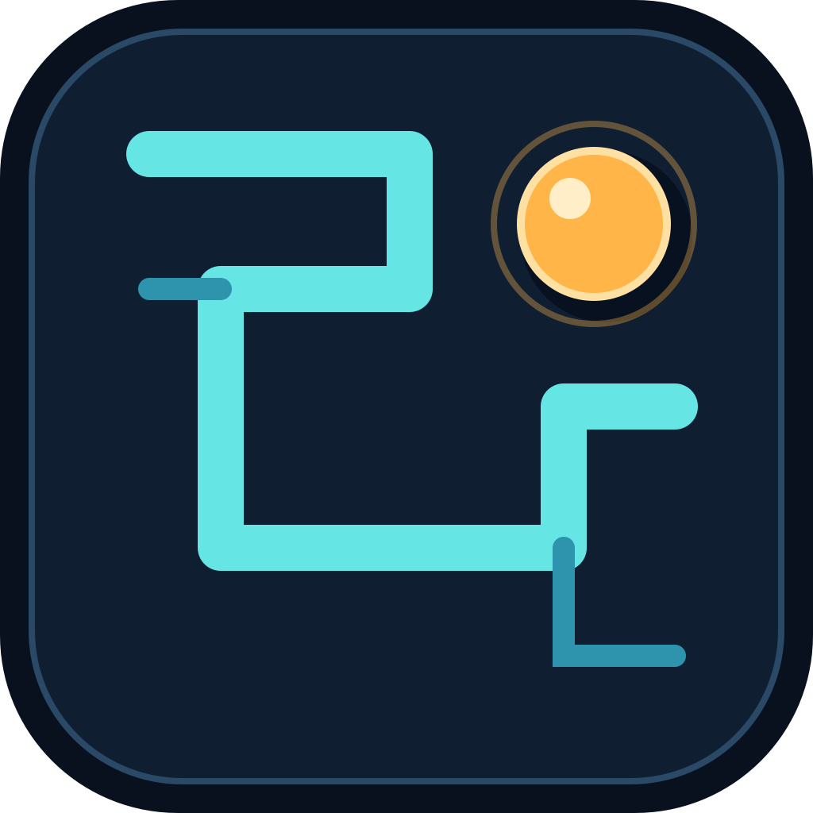

# 役次元 · 迷宫挑战

**让滚珠听你的倾斜。**

这是役次元的一款手机迷宫游戏。玩家通过倾斜手机，或使用触控模式控制滚珠穿过迷宫；滚珠撞上墙壁时，可以同步向兼容的 YYC-DJ 蓝牙设备发送渐强反馈。

游戏支持多套主题地图、固定关卡和随机生成地图，也支持 YYC-DJ 一代与 YYC-DJ-V2 二代设备。没有设备时，可以直接使用触控调试模式体验完整的迷宫玩法。

<p align="center">
  
</p>

## 玩法

### 倾斜手机穿过迷宫

连接设备或进入触控调试模式后，选择一张地图开始游戏。倾斜手机可以改变滚珠方向，滚珠需要从起点出发，避开墙壁并抵达终点。

游戏会记录本次用时。抵达终点后显示完成结果，可以立即重新开始，或切换到其他地图。

## 游戏规则

- 每局从地图中的 `S` 起点开始，抵达 `G` 终点后完成挑战。
- 内置 6 张固定地图：潮汐回廊、熔岩断层、月面冰原、晶脉回路、暮色迷城和氧化反应堆。
- 另外提供随机地图。随机地图使用种子生成，当前地图在本局内可以稳定复现。
- 支持倾斜和触控两种输入模式；设备没有可用传感器时会自动切换到触控模式。
- 开始游戏前可以扫描并连接 YYC-DJ 一代或 YYC-DJ-V2 二代设备，也可以选择触控调试模式。
- 蓝牙反馈强度上限为 `0-180`，设备协议会自动转换为设备所需的输出范围。
- 碰墙输出会逐步增强，离墙后立即发送停止输出，避免设备继续保持上一次状态。
- 暂停、重新开始、切换地图、修改设备设置、应用进入后台或设备断开时，游戏会停止蓝牙输出。
- 可以随时重新校准当前手机姿态，适应不同的握持角度和横竖屏方向。

## 好玩的点子，值得有更多版本

迷宫挑战把手机的运动传感器、真实蓝牙设备和简单的物理碰撞放在同一局游戏里。滚珠不是只在屏幕上移动，碰墙时还会把游戏状态反馈到设备上，让迷宫路线变成一场需要手感和节奏的挑战。

项目保留了普通 Dart 逻辑、Flame 游戏循环和 BLE 协议层的清晰边界，方便继续加入更多地图、主题、设备协议和玩法规则。

## 开源与许可

本项目采用 [MIT 许可证](LICENSE)。简单来说，你可以：

- 免费使用、复制和分享本项目。
- 修改代码并制作自己的版本。
- 将本项目用于商业产品、收费项目或线下活动。
- 在保留原许可证和版权声明的前提下继续分发。

## 开始体验

这是一个 Flutter 项目，本地运行需要 Flutter stable 和 Dart 3.3 或更高版本：

```bash
flutter pub get
flutter run
```
